<h3 align="center">Rhoan Barioni</h3>

  Desenvolvedor em formação • Estudante de Ciência da Computação

---

### Sobre
Desenvolvedor em formação com foco em me tornar **Full Stack**.  
Experiência com **JavaScript** no desenvolvimento web e estudos em **Java** para back-end.

---

### Tecnologias

**Estudando**
 

 

**Frontend**
 

 

**Backend**
 

 

**Ferramentas**
 

---

### Projetos

| Projeto | Descrição | Tecnologias |
|--------|-----------|-------------|
| [🗺️ AcadMap](https://rhoanbarioni.github.io/AcadMap/) | Aplicação web para visualização e organização de informações acadêmicas | React, Vite, JavaScript, HTML, SCSS |
| [🏗️ ROYAL](https://royalconstru.com.br/) | Site institucional desenvolvido para empresa de construção civil | HTML, SCSS, JavaScript |
| [📜 LGPD_Facul](https://rhoanbarioni.github.io/LGPD_Facul/) | Página informativa sobre a LGPD desenvolvida como projeto acadêmico | HTML, SCSS, JavaScript |

---

  <!-- Stats Card -->
  <picture>
    <source srcset="./profile/stats-dark.svg" media="(prefers-color-scheme: dark)">
    <source srcset="./profile/stats-light.svg" media="(prefers-color-scheme: light)">
    
  </picture>

  <!-- Top Languages Card -->
  <picture>
    <source srcset="./profile/top-langs-dark.svg" media="(prefers-color-scheme: dark)">
    <source srcset="./profile/top-langs-light.svg" media="(prefers-color-scheme: light)">
    
  </picture>

---

### Contato
- [Portfólio](https://github.com/RhoanBarioni)
- [LinkedIn](https://www.linkedin.com/in/rhoanbarioni/)